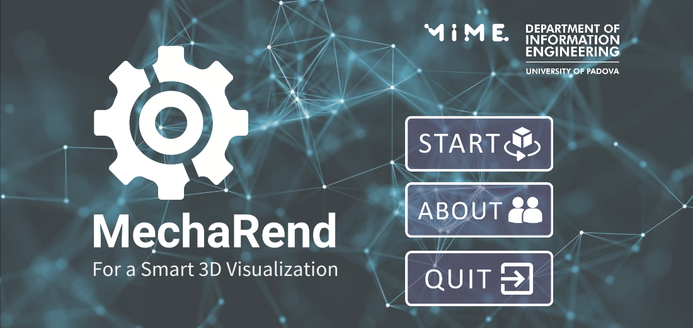
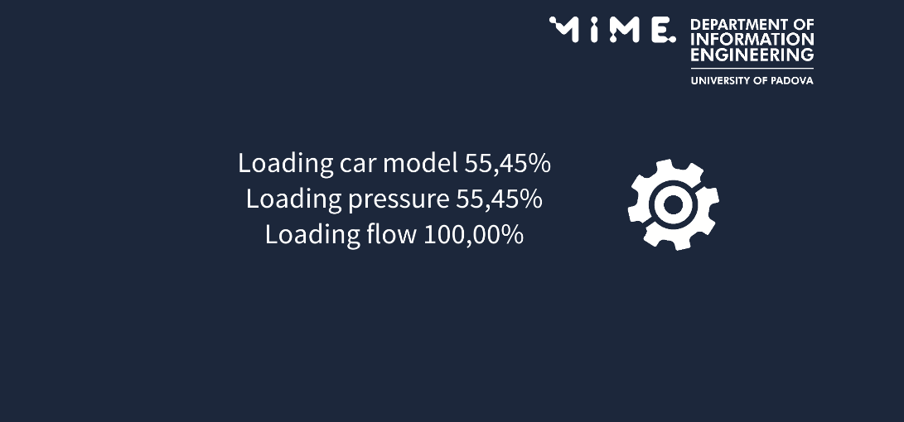
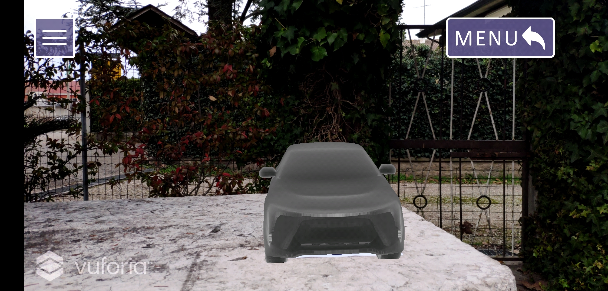
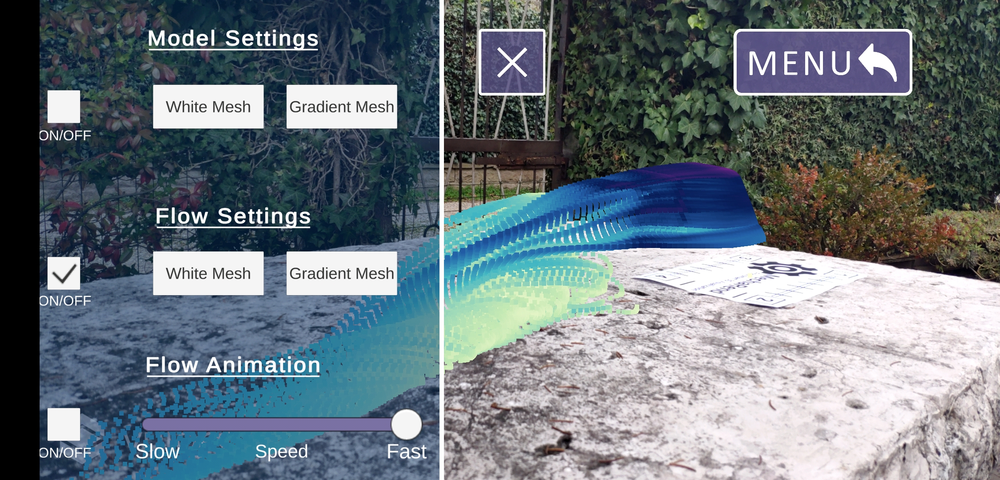
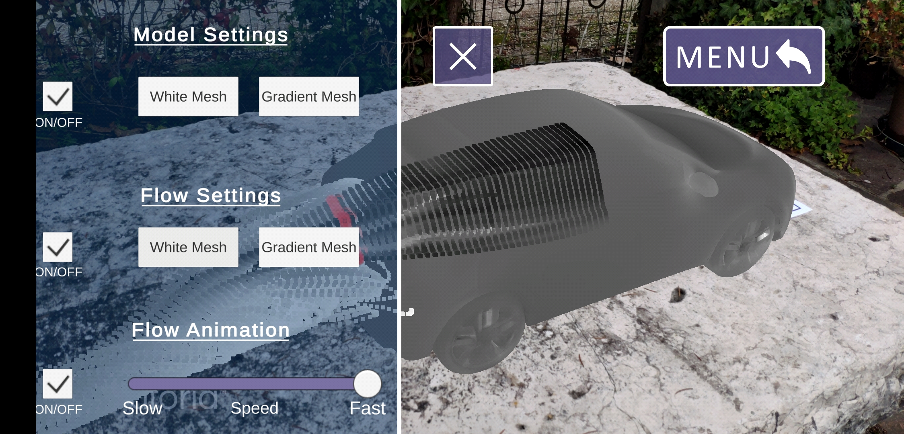

# 3D Augmented Reality Project - MechaRend
The goal of this project is to create a Unity application that visualizes some physical properties like  pressure and aerodynamics, for a 3D car mechanical model. 
The two datasets provided are in binary format and represent respectively the 3D model of a car in form of a sequence of 3D points, including the pressure value for each point and the data of a portion airflow around the car, localized with 5-dimensional vectors that represent the space coordinates (x, y, z), time coordinate, and intensity value. 
The datasets are provided by Altair (www.altair.com) for University of Padua, Department of Information Engineering, Master Degree in ICT for Internet and Multimedia, 3D Augmented Reality courses project, for this reason they will not be available to the public. 
For the visualization purpose we used Vuforia Engine to visualize the models in a 3D augmented reality environment and designed a user interface that allows to switch between static and dynamic visualization for the flow in runtime. 
The dynamic visualization part is implemented using Unity’s Particle System while for the static one we simply used point cloud rendering with meshes that contained only vertex information. 
For the point cloud rendering and coloring we get inspiration from the GitHub repo https://github.com/CristobalBL/pointcloud-unity-example. 

Unity 	version 2020.2.1f1 
Vuforia version 9.5.4 

## In-App Previews

